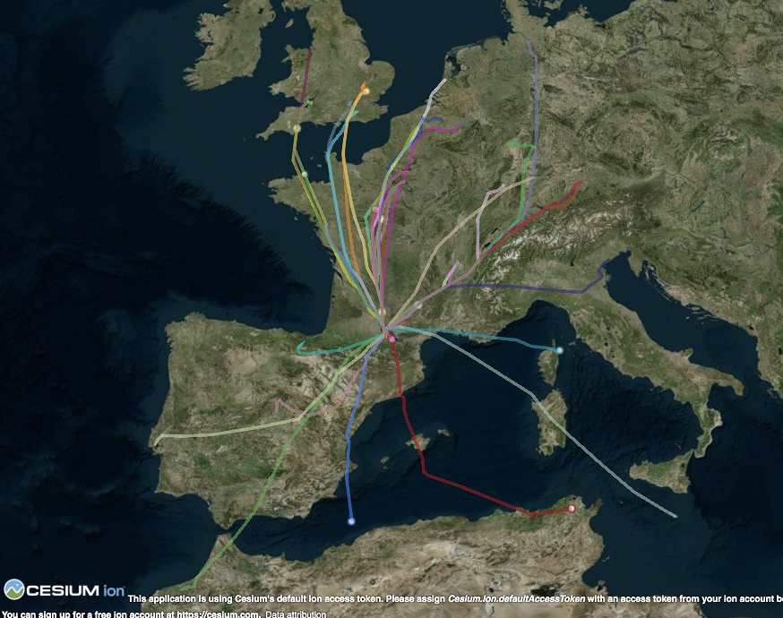

# so6 air traffic file to CesiumJS CZML

Generation of a CZML file from so6 air traffic file
This CZML file can be read by CesiumJS. The traffic is represented by :
* static objects (trajectories)
* dynamic objects (tracks)

Example: display all flights from LFBO airport

  

## Built With

* [pandas](https://pandas.pydata.org/) - Python Data Analysis Library
* [CesiumJS](https://cesiumjs.org/) - Open-source JavaScript library for world-class 3D globes and maps

## Authors

* **Thomas Dubot** 

## License

This project is licensed under the MIT License - see the [LICENSE.md](LICENSE.md) file for details

## Acknowledgments

Thanks to Will Geary's tutorial [Visualizing a Bike Ride in 3D](https://willgeary.github.io/GPXto3D/) 

